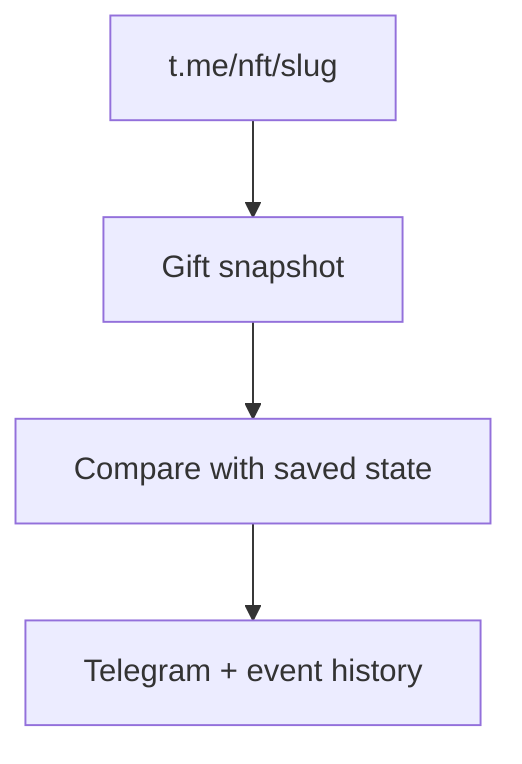

# Telegram NFT Gift Monitor

[Русский](README.md) · [English](README_EN.md)

Монитор конкретных NFT-подарков по публичным страницам t.me. Сравнивает снимки подарка и сообщает в Telegram об изменениях владельца и атрибутов. Пользовательская Telegram-сессия не нужна.

## Требования

- Python 3.14 или новее;
- Telegram-бот от [@BotFather](https://t.me/BotFather);
- Telegram ID каждого администратора;
- хотя бы один NFT slug или полная ссылка.

## Быстрый старт

### 1. Клонируйте репозиторий

```bash
git clone https://github.com/soroka01/Telegram-nft-gifts-monitoring.git
cd Telegram-nft-gifts-monitoring
```

### 2. Быстрый старт на Windows

```bat
start.bat
```

При первом запуске файл:

1. создаст `.venv`;
2. скопирует `config.example.json` в `config.json`;
3. остановится, чтобы вы заполнили конфигурацию.

Заполните в `config.json` токен бота, ID администраторов и список подарков, затем снова запустите `start.bat`.

### 3. Ручной запуск

```bash
python -m venv .venv
```

Windows PowerShell:

```powershell
.\.venv\Scripts\Activate.ps1
python -m pip install -r requirements.txt
Copy-Item config.example.json config.json
python main.py
```

Linux или macOS:

```bash
source .venv/bin/activate
python -m pip install -r requirements.txt
cp config.example.json config.json
python main.py
```

## Как это работает



## Цели мониторинга

Простой список:

```json
{
  "monitor": {
    "targets": [
      "ExampleGift-12345",
      "https://t.me/nft/AnotherGift-67890"
    ]
  }
}
```

Поддерживаются:

- slug `ExampleGift-12345`;
- полная ссылка `https://t.me/nft/ExampleGift-12345`;
- `tg://nft?slug=ExampleGift-12345`;
- объект с флагом включения:

```json
{"slug": "ExampleGift-12345", "enabled": true}
```

Невалидные и повторяющиеся slug отбрасываются.

## Настройки

### Бот

```json
{
  "bot": {
    "token": "PUT_TELEGRAM_BOT_TOKEN_HERE",
    "admin_ids": [123456789]
  }
}
```

Замените и token, и пример ID. Монитор принимает команды и отправляет уведомления только пользователям из `admin_ids`.

### Монитор

| Поле | По умолчанию | Назначение |
| --- | ---: | --- |
| `targets` | — | Список подарков; обязателен |
| `interval_seconds` | `30` | Пауза между циклами; минимум 5 секунд |
| `request_timeout_seconds` | `10` | Тайм-аут HTTP; минимум 2 секунды |
| `request_delay_seconds` | `0.25` | Пауза между подарками внутри цикла |
| `jitter_seconds` | `3` | Случайная добавка к паузе между циклами |
| `error_backoff_seconds` | `120` | Сколько пропускать цель после ошибки |
| `stale_error_notify_seconds` | `3600` | Когда ошибка становится достаточно долгой для alert |
| `notify_initial_snapshot` | `true` | Отправить baseline после первого чтения |
| `notify_errors` | `true` | Разрешить автоматические error alerts |
| `track_image_url` | `false` | Считать image URL значимым изменением |
| `timezone` | `Europe/Moscow` | Часовой пояс для отображения |
| `state_path` | `state/nft_gift_state.json` | Путь к state |
| `events_path` | `logs/nft_gift_events.jsonl` | Путь к события JSONL |
| `user_agent` | browser-like | User-Agent публичного HTTP-запроса |

### Переменные окружения

Значения окружения имеют приоритет над соответствующими полями:

| Переменная | Поле |
| --- | --- |
| `BOT_TOKEN` | `bot.token` |
| `ADMIN_IDS` | `bot.admin_ids`, через запятую |
| `NFT_GIFT_TARGETS` | `monitor.targets`, через запятую |

## Команды Telegram

| Команда | Действие |
| --- | --- |
| `/start` | Справка и кнопки |
| `/help` | Справка |
| `/status` | Состояние цикла, paths и последний результат |
| `/gifts` | Настроенные подарки и последние snapshots |
| `/check` | Немедленно проверить все подарки |
| `/check ExampleGift-12345` | Проверить один slug |
| `/snapshot ExampleGift-12345` | Показать сохранённый snapshot |

Запросы пользователей вне `admin_ids` получают отказ в доступе.

## Состояние и журналы

| Путь | Содержимое |
| --- | --- |
| `state/nft_gift_state.json` | Последний snapshot каждого slug |
| `logs/nft_gift_events.jsonl` | Baseline, meaningful changes и errors |
| `logs/gifts/<slug>/nft_gift_events.jsonl` | Та же лента для одного подарка |
| `logs/monitor.log` | Технический журнал |

Изменения quantity/issued/total обновляют state и видны в техническом log, но если изменились только эти поля, отдельный JSONL event не создаётся. Original details и avatar URL сами не вызывают Telegram alert: при отдельном изменении они пишутся как `ignored_change`, а при одновременном значимом изменении входят в общий JSONL event. Image URL вызывает alert только при `track_image_url = true`.

После `429` или `5xx` конкретный slug переходит в backoff. Автоматическое сообщение об ошибке отправляется только когда последнего успешного снимка нет дольше `stale_error_notify_seconds`; ручной `/check` сообщает ошибку сразу.

## Безопасность

- Никогда не коммитьте `config.json` или `.env`.
- Замените пример `admin_ids`; он является синтаксически допустимым ID.
- State и JSONL могут содержать владельцев, адреса TON и историю изменений.
- После утечки bot token немедленно отзовите его.

## Ограничения

- HTML-разбор зависит от текущей структуры публичной страницы t.me.
- Монитор видит только данные, которые Telegram публикует на публичной NFT-странице.
- Telegram может ограничивать частые HTTP-запросы.
- Пустая или временно изменённая публичная страница может задержать фиксацию события.
- Тексты бота и журналы преимущественно русскоязычные.

## Лицензия

[MIT](LICENSE).

## Поддержка

Можно [форкнуть репозиторий](https://github.com/soroka01/Telegram-nft-gifts-monitoring/fork) и доработать под себя. Если проект пригодился, поставьте [Star](https://github.com/soroka01/Telegram-nft-gifts-monitoring) — так я увижу, что он был кому-то полезен.

---

with love ❤️
