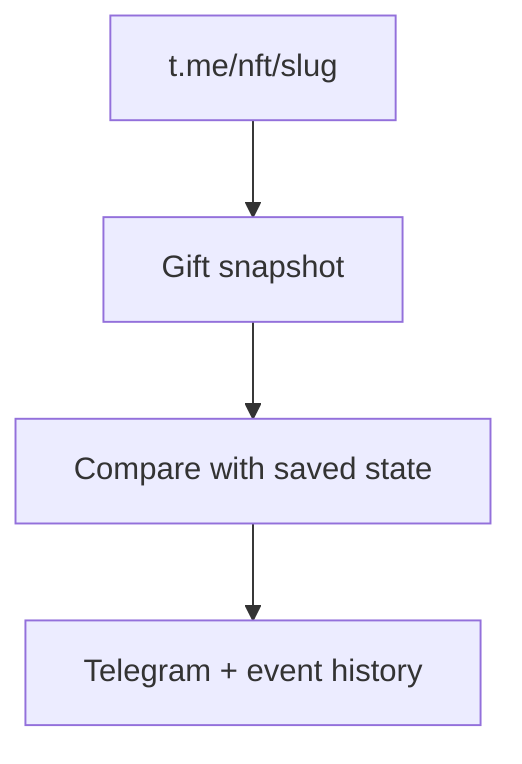

# Telegram NFT Gift Monitor

[Русский](README.md) · [English](README_EN.md)

Monitor for individual NFT gifts using public t.me pages. Compares snapshots and reports owner and attribute changes in Telegram. No Telegram user session is required.

## Requirements

- Python 3.14 or newer;
- a Telegram bot from [@BotFather](https://t.me/BotFather);
- the Telegram user ID of each administrator;
- at least one NFT slug or full URL.

## Quick start

### 1. Clone the repository

```bash
git clone https://github.com/soroka01/Telegram-nft-gifts-monitoring.git
cd Telegram-nft-gifts-monitoring
```

### 2. Quick start on Windows

```bat
start.bat
```

On its first run, the launcher:

1. creates `.venv`;
2. copies `config.example.json` to `config.json`;
3. exits so you can fill in the configuration.

Fill in the bot token, administrator IDs, and gift targets in `config.json`, then run `start.bat` again.

### 3. Manual start

```bash
python -m venv .venv
```

Windows PowerShell:

```powershell
.\.venv\Scripts\Activate.ps1
python -m pip install -r requirements.txt
Copy-Item config.example.json config.json
python main.py
```

Linux or macOS:

```bash
source .venv/bin/activate
python -m pip install -r requirements.txt
cp config.example.json config.json
python main.py
```

## How it works



## Monitoring Targets

A simple list:

```json
{
  "monitor": {
    "targets": [
      "ExampleGift-12345",
      "https://t.me/nft/AnotherGift-67890"
    ]
  }
}
```

Supported forms:

- a slug such as `ExampleGift-12345`;
- a full URL such as `https://t.me/nft/ExampleGift-12345`;
- `tg://nft?slug=ExampleGift-12345`;
- an object with an enable flag:

```json
{"slug": "ExampleGift-12345", "enabled": true}
```

Invalid and duplicate slugs are discarded.

## Configuration

### Bot

```json
{
  "bot": {
    "token": "PUT_TELEGRAM_BOT_TOKEN_HERE",
    "admin_ids": [123456789]
  }
}
```

Replace both the token and the example ID. The monitor accepts commands from and sends notifications only to users in `admin_ids`.

### Monitor

| Field | Default | Purpose |
| --- | ---: | --- |
| `targets` | — | Gift list; required |
| `interval_seconds` | `30` | Delay between cycles; minimum 5 seconds |
| `request_timeout_seconds` | `10` | HTTP timeout; minimum 2 seconds |
| `request_delay_seconds` | `0.25` | Delay between gifts within one cycle |
| `jitter_seconds` | `3` | Random addition to the cycle delay |
| `error_backoff_seconds` | `120` | How long to skip a target after an error |
| `stale_error_notify_seconds` | `3600` | How long an error must persist before an alert |
| `notify_initial_snapshot` | `true` | Send the first baseline |
| `notify_errors` | `true` | Allow automatic error alerts |
| `track_image_url` | `false` | Treat image URL changes as significant |
| `timezone` | `Europe/Moscow` | Display time zone |
| `state_path` | `state/nft_gift_state.json` | State path |
| `events_path` | `logs/nft_gift_events.jsonl` | JSONL event path |
| `user_agent` | browser-like | User-Agent for public HTTP requests |

### Environment Variables

Environment values take precedence over matching fields:

| Variable | Field |
| --- | --- |
| `BOT_TOKEN` | `bot.token` |
| `ADMIN_IDS` | `bot.admin_ids`, comma-separated |
| `NFT_GIFT_TARGETS` | `monitor.targets`, comma-separated |

## Telegram Commands

| Command | Action |
| --- | --- |
| `/start` | Help and inline keyboard |
| `/help` | Help |
| `/status` | Cycle state, paths, and last result |
| `/gifts` | Configured gifts and latest snapshots |
| `/check` | Check every gift immediately |
| `/check ExampleGift-12345` | Check one slug |
| `/snapshot ExampleGift-12345` | Show a saved snapshot |

Users outside `admin_ids` receive an access-denied response.

## State, Events, and Errors

| Path | Contents |
| --- | --- |
| `state/nft_gift_state.json` | Latest snapshot for each slug |
| `logs/nft_gift_events.jsonl` | Baselines, meaningful changes, and errors |
| `logs/gifts/<slug>/nft_gift_events.jsonl` | The same stream for one gift |
| `logs/monitor.log` | Technical runtime log |

Quantity/issued/total changes update state and appear in the technical log, but no separate JSONL event is written when only those fields change. Original details and avatar URLs do not trigger alerts: on their own they are written as `ignored_change`, and alongside a significant change they are included in the shared JSONL event. Image URL changes alert only when `track_image_url = true`.

After a `429` or `5xx`, the affected slug enters backoff. An automatic error message is sent only when the latest successful snapshot is older than `stale_error_notify_seconds`; a manual `/check` reports the error immediately.

## Security

- Never commit `config.json` or `.env`.
- Replace the placeholder `admin_ids`; it is a syntactically valid ID.
- State and JSONL may contain owners, TON addresses, and change history.
- Revoke leaked bot tokens immediately.

## Limitations

- HTML parsing depends on the current public t.me page structure.
- The monitor sees only data that Telegram publishes on the public NFT page.
- Telegram may rate-limit frequent HTTP requests.
- A missing or transient public page may delay an event.
- Bot messages and runtime logs are primarily in Russian.

## License

[MIT](LICENSE).

## Support

Feel free to [fork this repository](https://github.com/soroka01/Telegram-nft-gifts-monitoring/fork) and adapt it. If it helped you, leave a [Star](https://github.com/soroka01/Telegram-nft-gifts-monitoring) so I can see it was useful.

---

with love ❤️
